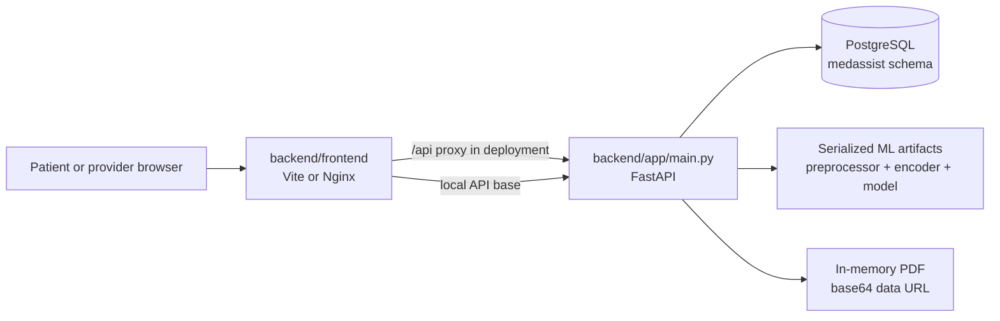
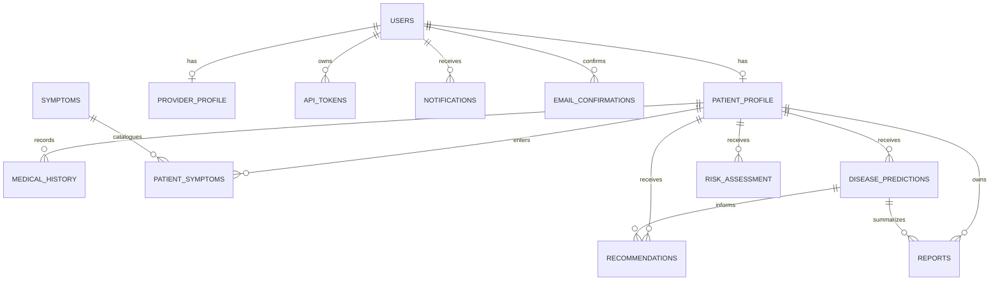

# MedAssist AI: Project Documentation

## 1. Purpose and Scope

MedAssist AI is an educational full-stack healthcare workflow application. It combines patient symptom and history entry, machine-learning disease prediction, rule-based risk assessment, provider review, recommendations, notifications, and report generation.

The application is decision support, not a diagnostic or prescribing service. Predictions and recommendations require review by a qualified healthcare professional before clinical use.

This document describes the implementation that is actually wired into local development, Docker Compose, and Azure deployment. The active application is the FastAPI service in `backend/app` and the React application in `backend/frontend`.

## 2. Active System at a Glance



### Repository areas

| Area | Responsibility |
|---|---|
| `backend/app/main.py` | FastAPI application, authentication, authorization, workflows, prediction, risk, reports, notifications, and endpoint handlers |
| `backend/app/models.py` | SQLAlchemy table mappings |
| `backend/app/schemas.py` | Pydantic request models and validation |
| `backend/app/crud.py` | User creation and password hashing helpers |
| `backend/app/recommendation_engine.py` | Disease-keyword recommendation generation |
| `backend/db/` | PostgreSQL connection, schema initialization, and SQL schema |
| `backend/ml/` | Model training code and serialized runtime artifacts |
| `backend/frontend/` | Active React/Vite frontend and production Nginx image |
| `infra/main.bicep` | Azure Container Apps, registry, logging, and PostgreSQL resources |
| `scripts/deploy-azure.ps1` | Azure image build and infrastructure deployment |
| `backend/test_*.py` | Backend tests and integration/debug scripts |

The root `frontend/` directory and `backend/main.py` are legacy implementations. They use a different API contract and are not used by `start-dev.ps1`, Docker Compose, or the Azure deployment.

## 3. Runtime and Startup

### Prerequisites

- Windows PowerShell for the supplied scripts
- Python 3.11 or compatible Python runtime
- Node.js 20 or compatible npm runtime for the active frontend
- PostgreSQL, or Docker Desktop for the complete container stack

### Local development

The supported helper is:

```powershell
.\start-dev.ps1
```

It starts:

- FastAPI/Uvicorn at `http://127.0.0.1:8000`
- Vite frontend at `http://127.0.0.1:5173`

Manual equivalent:

```powershell
cd backend
..\venv\Scripts\python -m pip install -r requirements.txt
..\venv\Scripts\python -m db.init_db
..\venv\Scripts\python -m uvicorn app.main:app --reload --port 8000
```

In another PowerShell window:

```powershell
cd backend\frontend
npm install
npm run dev
```

The backend initializes the schema on application startup. It loads `.env` from `backend/.env` first, then the repository root `.env`. The preferred database setting is `DATABASE_URL`; otherwise it uses `POSTGRES_HOST`, `POSTGRES_PORT`, `POSTGRES_DB`, `POSTGRES_USER`, and `POSTGRES_PASSWORD`.

### Docker Compose

```powershell
docker compose up --build
```

The services are:

| Service | Container role | Local address |
|---|---|---|
| `db` | PostgreSQL 16 with a persistent `postgres_data` volume | Internal only |
| `api` | FastAPI and schema initialization | `http://localhost:8000` |
| `web` | Built React files served by Nginx | `http://localhost:8081` |

The Nginx container proxies `/api/` to `medassist-api:8000/`, allowing the deployed browser client to use one origin.

## 4. Authentication and Authorization

Registration accepts `patient`, `doctor`, and `admin` roles. Patients receive a `patient_profile`; doctors receive a `provider_profile`. The API currently treats `doctor` and `provider` as provider roles for protected provider endpoints.

Login creates a random bearer token and stores it in `api_tokens`. The active frontend stores the token under `medassist_token` and sends it as:

```text
Authorization: Bearer <token>
```

Patient endpoints require the patient role. Provider endpoints require the doctor/provider role. The provider dashboard currently aggregates all patients and records rather than enforcing provider-to-patient assignment.

There is no token expiration, revocation endpoint, or logout token deletion in the active API. Email confirmation tokens are created, but the current implementation does not visibly expire them or mark the user as confirmed.

## 5. API Reference

All paths below are rooted at the API origin. Protected endpoints require a bearer token unless stated otherwise.

### Public and authentication endpoints

| Method | Path | Purpose |
|---|---|---|
| `GET` | `/` | Health response |
| `POST` | `/register` | Create a patient, provider, or admin account |
| `GET` | `/confirm?token=...` | Confirm an email token |
| `POST` | `/login` | Authenticate and issue an API token |
| `GET` | `/symptoms/search` | Search the symptom catalog; public endpoint |

### Notifications

| Method | Path | Purpose |
|---|---|---|
| `GET` | `/notifications` | List notifications for the authenticated user |
| `POST` | `/notifications/{notification_id}/read` | Mark one notification as read |
| `POST` | `/notifications/read-all` | Mark all notifications as read |

### Patient endpoints

| Method | Path | Purpose |
|---|---|---|
| `GET` | `/dashboard/patient` | Patient dashboard aggregate |
| `GET`, `PUT` | `/patient/profile` | Read or update patient profile |
| `GET`, `POST` | `/patient/history` | List or create medical history entries |
| `PUT`, `DELETE` | `/patient/history/{history_id}` | Update or delete a history entry |
| `GET`, `POST` | `/patient/symptoms` | List or create symptom entries |
| `PUT`, `DELETE` | `/patient/symptoms/{symptom_id}` | Update or delete a symptom entry |
| `POST` | `/patient/prediction` | Run disease prediction, persist prediction, and create initial recommendations/report data |
| `POST` | `/patient/risk` | Calculate and persist a risk assessment |
| `PUT` | `/patient/settings` | Update password and user preferences |
| `GET` | `/patient/recommendations` | Return patient-visible recommendations |
| `GET` | `/patient/reports` | Return patient reports |
| `GET` | `/patient/predictions/{prediction_id}/recommendations` | Return recommendations for a prediction |

### Provider endpoints

| Method | Path | Purpose |
|---|---|---|
| `GET` | `/dashboard/provider` | Provider dashboard aggregate |
| `GET` | `/provider/analytics` | Population and prediction analytics |
| `POST` | `/provider/recommendations` | Create a provider recommendation |
| `POST` | `/provider/recommendations/review` | Review or update a recommendation |
| `POST` | `/provider/reports` | Create a provider report |
| `POST` | `/provider/prediction/feedback` | Approve/reject a prediction and add comments |
| `GET` | `/provider/predictions/{prediction_id}/recommendations` | Return recommendations for provider review |

Request payloads are defined in `backend/app/schemas.py`. Approval values are normalized to `pending`, `approved`, or `rejected`; `accept` and `approve` are aliases for `approved`, and `reject` is an alias for `rejected`.

## 6. Data Model



The physical schema is in `backend/db/schema.sql`, under the PostgreSQL `medassist` schema. Important relationships use cascading deletion from users to profiles and from patient profiles to clinical records. Recommendations and reports retain nullable prediction references with `ON DELETE SET NULL`.

## 7. End-to-End Workflows

### Patient workflow

1. Register with patient role and profile fields.
2. Log in and receive a bearer token.
3. Update profile and medical history.
4. Search the symptom catalog and submit symptom details.
5. Request `/patient/prediction` with symptom IDs or names.
6. The API loads the patient profile and serialized model artifacts, predicts a disease, stores the prediction, generates pending recommendations, and creates provider notifications.
7. Request `/patient/risk`; the rule engine stores a risk score, level, factors, and warning.
8. View only recommendations permitted by their status and review reports.
9. Receive provider feedback and updated recommendations or reports.

### Provider workflow

1. Register as `doctor` or use a provider account.
2. Open the provider dashboard and view aggregated patient data.
3. Review patient histories, symptoms, predictions, risk assessments, recommendations, and reports.
4. Approve or reject predictions and recommendations, with optional comments.
5. Create provider recommendations and reports.
6. The system updates patient-visible status and can generate a PDF report payload.

## 8. Prediction, Risk, and Recommendation Logic

### Disease prediction

The runtime loads:

- `backend/ml/models/preprocessor.pkl`
- `backend/ml/models/label_encoder.pkl`
- `backend/ml/models/best_model.pkl`

The input contains up to seven symptom features plus profile-derived gender, age, height, weight, and BMI. Missing values are filled with defaults in `backend/app/main.py`. If the model supports `predict_proba`, the highest probability becomes the confidence score.

The training pipeline in `backend/ml/train_models.py` reads `symptom_based_medicine_recommendation_dataset.csv`, one-hot encodes categorical and symptom features, scales numerical features, and compares decision tree, random forest, logistic regression, XGBoost, and TensorFlow models. Runtime currently selects the pickle artifact; `best_model.keras` is not loaded by the active inference path.

### Risk assessment

Risk scoring starts at 15 and adds points for:

- age bands
- chronic-condition keywords
- BMI of at least 30
- five or more symptoms
- configured severe symptoms
- high-risk disease keywords
- smoking, alcohol, or low activity indicators

The final score is capped at 100. Levels are `Low` below 40, `Moderate` from 40 through 69, and `High` at 70 or above. The API stores each assessment in `risk_assessment`.

### Recommendations and reports

`backend/app/recommendation_engine.py` generates deterministic treatment, preventive, lifestyle, and follow-up guidance based on disease keywords. AI-generated recommendations are initially pending provider review. The application builds PDF-like reports in memory with ReportLab and returns the generated content as a base64 data URL.

## 9. Deployment

Azure deployment uses `scripts/deploy-azure.ps1` and `infra/main.bicep` to provision:

- Azure Container Apps environment
- private FastAPI Container App
- public Nginx frontend Container App
- Azure Container Registry
- Azure Database for PostgreSQL Flexible Server
- Log Analytics-backed Container Apps logging

The frontend image is built from `backend/frontend/Dockerfile` with `VITE_API_BASE=/api`. Nginx proxies API calls to the private API container. The API image includes the model artifacts under `backend/ml/models` and runs schema initialization before Uvicorn.

Deployment prerequisites and commands are documented in `AZURE_DEPLOYMENT.md`. Before using real clinical data, replace sample credentials, tighten PostgreSQL networking, use managed identity/Key Vault for secrets, and review the provider data-access boundary.

## 10. Verification and Tests

The repository includes tests for risk behavior, report workflow, provider role validation, dashboard flow, database connectivity, token behavior, CORS, and selected API paths. Useful commands include:

```powershell
cd backend
..\venv\Scripts\python -m pytest
```

The current suite is not a complete system verification suite. There is no evident comprehensive automated coverage for token expiry/revocation, all profile/history/symptom CRUD branches, model artifact loading, provider tenant scoping, frontend build behavior, Docker startup, or Azure deployment.

## 11. Known Implementation Risks and Follow-up Work

These items were identified from the current source and should be tracked separately from feature documentation:

1. `POST /provider/reports` appears to reference a local `prediction` value that is not assigned in the handler; exercise this endpoint before release.
2. Latest-risk retrieval orders multiple rows but appears to use `scalar_one_or_none()` without limiting the query, which can fail after multiple assessments exist.
3. `backend/test_evaluate_risk.py` references `PatientSymptom.symptom_name`, although the model stores the name on the related `Symptom` table.
4. The provider dashboard exposes all patient records to any authorized provider; assignment or tenant scoping is needed for production.
5. Bearer tokens have no expiration, revocation, or cleanup policy.
6. The legacy `backend/main.py` contains hard-coded secrets and should be removed or secured even though it is not deployed.
7. The README and training/runtime artifacts describe a `.keras` model path, but runtime inference currently loads `best_model.pkl` only.
8. The training script's default output directory must be aligned with `backend/ml/models` before retraining artifacts for deployment.
9. The Azure database connection and firewall configuration should be hardened before handling sensitive healthcare data.

## 12. Documentation Map

- Quick project overview: `README.md`
- Backend setup: `backend/README.md`
- This end-to-end architecture and operations guide: `docs/PROJECT_DOCUMENTATION.md`
- Local orchestration: `start-dev.ps1`
- Container topology: `docker-compose.yml`
- Azure deployment: `AZURE_DEPLOYMENT.md`
- API implementation: `backend/app/main.py`
- Database schema: `backend/db/schema.sql`
- Model training: `backend/ml/train_models.py`